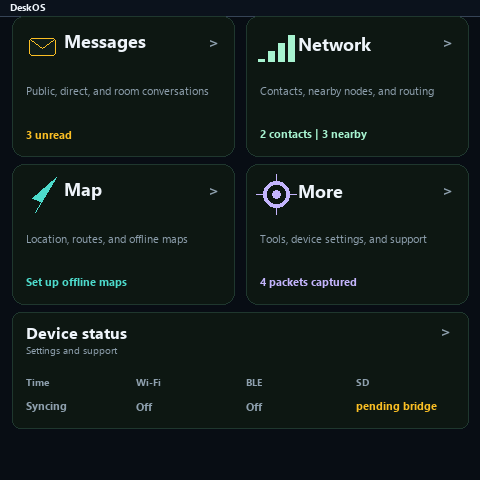
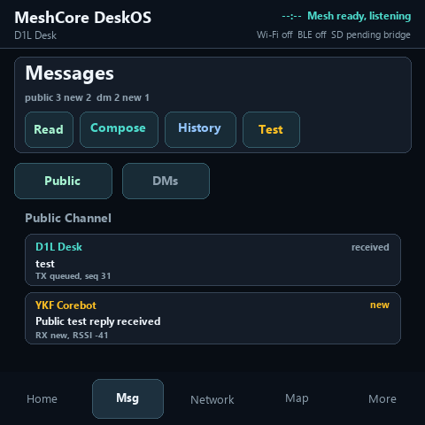
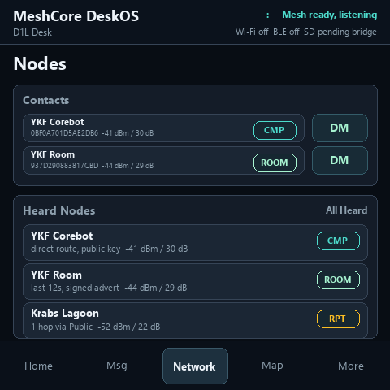
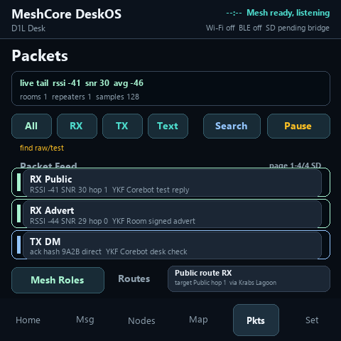
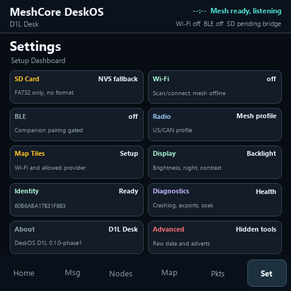
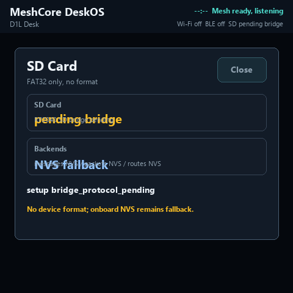
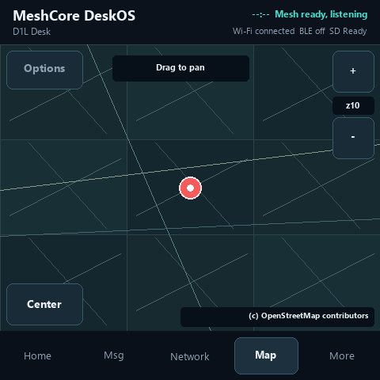
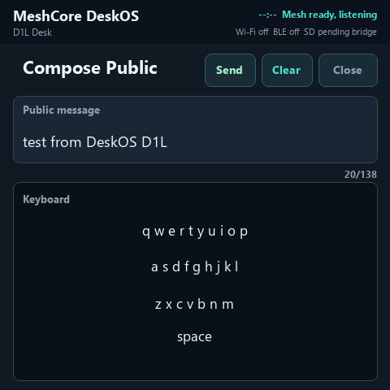
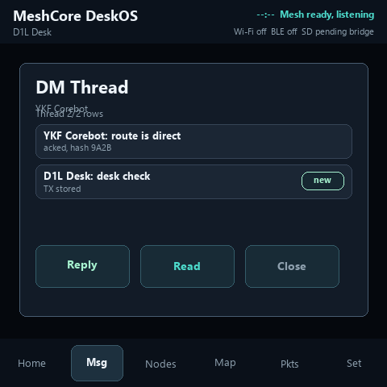
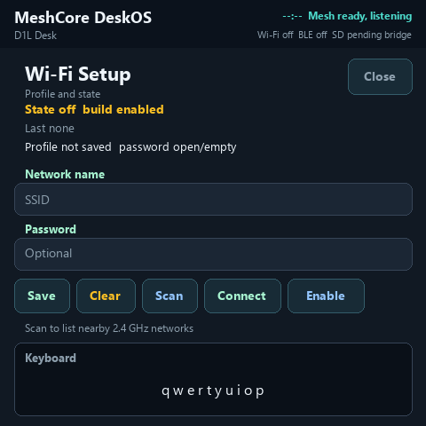

# MeshCore DeskOS D1L

MeshCore DeskOS D1L is firmware for the Seeed SenseCAP Indicator D1L: ESP32-S3, RP2040, 480x480 touch display, and SX1262 LoRa radio. The goal is a touch-first MeshCore desk console for Public messages, direct messages, node visibility, packet diagnostics, and optional FAT32 SD-card backed history.

Current public-release status: **not ready to tag**. Exact merged `main` `bd201a1fa561d67082012c6ebec0e0e554e60e58` / Actions `29374390847` passes 1,026 host plus 32 checksum tests, firmware packaging, conformance/fuzz, provenance, and SPDX; strict receipt SHA-256 is `3d06276cbfca0566e0625baaa1189406f3c6cae45b50d2a50477486143ec0733`. This banks software/artifact foundations, not physical or RF closure. Trusted time admission/migration/recovery, reliable PATH/direct fallback, live connectivity, remaining UI/user features, signed update/recovery, exact-candidate SD/RF/UI/power evidence, and final soaks remain release blockers. Use `include_sd_bridge=false` unless SD/RP2040 evidence changed. No tag may be cut until the exact release-commit gate is green.

## Feature Matrix

Status values: Working, Hardware-proven, Partial, Experimental, Not started.

| Area | Status | Notes |
|---|---|---|
| ESP-IDF migration target | Partial | Issue #63 selects version-pinned `espressif/idf:v5.5.4`. Standalone migration commit `39a043c` has the exact Actions-generated lock plus green host, firmware, package, checksum, release, and effective-config checks. The combined candidate still requires green Actions, exact COM12 `version.idf=v5.5.4` and behavioral proof, and refreshed commit-matched release evidence. |
| GitHub Actions firmware package | Working | Default ESP32/UI CI builds the ESP32 firmware and release package without rebuilding RP2040 artifacts. `include_sd_bridge=true` or SD/RP2040 path changes opt into the RP2040 SD bridge UF2 and official Seeed SD smoke UF2 checksums. Firmware compilation, dependency resolution, and packaging remain Actions-only. |
| Touch Home and shell navigation | Partial | Home is a quiet dashboard with Messages, Network, Map, and More destinations plus one Device status card. Non-Home pages use the matching five-item dock; Packets, diagnostics, connections, storage, and device settings live under More. Focused modules own Home, More, Map, bounded Messages and Nodes view models, and the Packet controller; shared screen/modal boundaries preserve one root and one active nested page. PR #56 proves Home and PR #61 proves Storage. Remaining route/contact/settings domains, UI-task command ownership, lifecycle/generation/redraw contracts, final combined-COM12 pixels, Map behavior, and manual physical review remain open. |
| Compose/input keyboard capture | Hardware-proven | PR #35 / issue #2 captured the historical 12-input set on COM12 from `fce5d82` / Actions `28727064923`. The built-in map source removes the provider keyboard, so the active `--targets all` contract is now 11 inputs (`capture_count=11`): Public/DM compose, Public search, Packet search, contact edit, onboarding, map location, and Wi-Fi SSID/password. The prior artifact remains valid evidence for those retained inputs. |
| Public messages | Hardware-proven | Public TX/RX plumbing, retained Public history, search, unread/read state, Packet-tab evidence, and a full-height message detail page with wrapped text plus nested technical details exist. |
| Direct messages | Partial | DM TX/store/thread UI exists; the full-height thread page marks read on open and keeps one sticky Reply action. PR #117 makes the runtime task the sole MeshCore request/TX-completion owner, persists queued/radio/ACK/retry/failure/reboot truth, rejects stale terminal callbacks by exact nonzero TX origin, recovers watchdog timeouts only for the active origin, and protects nonterminal outbound rows from ring eviction. Exact-candidate bidirectional RF/DM/ACK/retry/timeout/reboot/recovery and downstream UI/physical acceptance remain release blockers. |
| Multi-channel model and messaging | Partial | PR #114 adds a host-tested persistent Public-plus-seven channel model with stable channel/history identities, unread/default/source metadata, fail-closed schema-v2 CRC/lineage/generation, v1 migration, and secret-redacted normal reads. PR #116 adds one atomic redacted metadata snapshot, persisted default selection, and bounded app/USB list/select commands with no RF or SD-format side effects. Selected-channel send/receive/history/unread integration, channel-management UI, official-client interoperability, RF/physical proof, and WP-09 closure remain open. |
| Nodes, contacts, routes | Partial | Heard nodes, contacts, route trace/detail, role browser, and diagnostics exist. PR #59 proves the simplified contact hierarchy without invoking removal or Public RF. PR #60 / `0b138be` proves the bounded read-only Mesh Roles/Rooms/Repeaters pages on exact Actions-built COM12 pixels; physical touch review and final RF route proof remain open. |
| Packet diagnostics | Working | Packet list, filter/search, raw preview, detail sheet, and retained packet storage paths exist. PR #115 gives filter/search/pause/paging/fallback state one bounded controller with separate PSRAM query scratch and no direct LVGL/storage/RP2040 side effects. Exact-candidate scrolling, navigation, corruption, and physical UI acceptance remain open. |
| Retained storage scheduler | Partial | PR #118 gives Public, DM, packet, and route stores one descriptor scheduler with isolated serializers, one absolute request/queue/flush/pass deadline, stop-before-later-store deadline/quiesce behavior, coherent active/last-pass diagnostics, and overflow-safe finite tick conversion. Schema/reset/power-loss, NVS write-amplification/endurance, exact-candidate physical durability, and WP-11 closure remain open. |
| SD core file operations | Hardware-proven | Current COM12/COM16 evidence from `1a29876` / Actions `28714355561` proves official Seeed FAT32 smoke, FAT32 `READY_SD`, raw diagnostics, filecanary, safe boot scenarios for correct/missing/existing data plus RP2040-unavailable fallback, retained history after reboot, reboot/remount, map-tile canary, export canary, diagnostic export, and sampled data export without Public RF or formatting. |
| SD release matrix | Partial | PR #61 proves the read-only Storage/Card status/Data locations hierarchy on exact Actions-built COM12 pixels, including restored bounded scrolling and a fixed no-format footer; manual physical touch/photos remain open. The release matrix also still needs physical no-card and unformatted/non-FAT32 scenario proof, <=32GB FAT32 multi-card proof, and power/electrical evidence. Users prepare FAT32 cards on a computer; there is no device-side formatting path. |
| Map and tile cache | Partial | Map uses the built-in OpenStreetMap Standard tile source with no provider editor. The simple setup path is `Map -> Map options -> Set location or Cache status`; connect Wi-Fi, then open the actual Map. The Map starts at regional zoom 10, supports one-finger pan plus 44x44-or-larger `-`, `+`, and `Center` controls across zooms 8 through 14, and requests at most the visible current-view 3x3 at one zoom per visible generation, selected by the user. Completed exact-view Home-to-Map revisits reuse the retained rendered frame without network or SD reread; later sessions reuse cached tiles. There is no background, multi-zoom prefetch, off-screen batch, or area download, and `(c) OpenStreetMap contributors` stays visible. Network-suppressed probes never request tiles or mutate Wi-Fi/storage. Map-specific combined-COM12 pixels and live control/request/render/cancel/cache/heap proof remain pending. |
| Truthful time | Partial | PR #120 centralizes monotonic, wall, certificate-validity, and MeshCore protocol clocks; reserves `mesh_hi_v2` high water before use; bounds SNTP waits; and fails closed on ambiguous legacy `mesh_ts`. Trusted pre-system-clock SNTP admission, protocol forward-jump quarantine, retained wall recovery, explicit legacy migration, timezone/recovery UI, and exact-device proof remain open. |
| Wi-Fi | Partial | Setup UI and bounded serial controls exist and remain disabled by default. PR #121 adds a pure truthful connectivity view model and omits controls that cannot work; it does not replace live reconnect/safe-mode or exact-candidate hardware proof. Standalone `de79c9f` remains predecessor evidence for enable/connect/reconnect, saved-profile reboot, redacted scan, and memory floors. |
| BLE, OTA, GPS | Not started | Release-grade BLE companion transport, OTA, GPS/location-source integration, and nearby GPS node pins remain pending. |
| Soak and physical review | Partial | Short evidence exists. Full 12-hour idle/listening soak and physical photos/manual UI review are still open. |

Retained Public/DM message history, route history, packet history, diagnostic exports, sampled user-data exports, and map-tile cache can use SD only when the RP2040 bridge reports a ready FAT32 card with file operations and atomic rename. These retained stores keep NVS fallback available.

## Screenshots

These committed host simulator screenshots are representative of the current UI surfaces. They are not a substitute for physical device photos or issue-matched COM12 pixel-capture PNGs when a selected issue requires pixel evidence. Physical device photos are still required before release.

| Home | Messages | Network | Packets |
|---|---|---|---|
|  |  |  |  |

| More | Storage | Map |
|---|---|---|
|  |  |  |

| Compose | DM Thread | Wi-Fi |
|---|---|---|
|  |  |  |

## Host Checks

No hardware required. The local full suite remains available; CI runs ESP32/UI host
checks by default and runs SD/RP2040 dry-runs only when the SD bridge scope is
explicitly included.

```powershell
python -m pytest tests
python .\scripts\smoke_d1l.py --dry-run
python .\scripts\ui_corruption_probe_d1l.py --dry-run --rounds 20
python .\scripts\ui_capture_d1l.py --dry-run
python .\scripts\ui_compose_keyboard_capture_d1l.py --dry-run --targets all
python .\scripts\scroll_probe_d1l.py --dry-run --screens home,public_messages,dm_thread,nodes,packets,settings,storage,storage_card,storage_data,wifi,map,map_options,map_location,map_cache
python .\scripts\sd_file_canary_d1l.py --dry-run
python .\scripts\sd_retained_history_acceptance_d1l.py --dry-run --token dryrun
python .\scripts\sd_map_tile_canary_d1l.py --dry-run --token dryrun
python .\scripts\sd_reboot_remount_acceptance_d1l.py --dry-run --token dryrun
python .\scripts\sd_export_canary_d1l.py --dry-run --token dryrun
python .\scripts\sd_diagnostic_export_d1l.py --dry-run --token dryrun
python .\scripts\sd_data_export_d1l.py --dry-run --token dryrun
python .\scripts\release_gate_audit_d1l.py --out artifacts\release-gate\d1l-release-gate-audit-local.json
```

Firmware binaries are built by GitHub Actions only. The normal workflow path is
ESP32-first; it does not rebuild or package RP2040 artifacts unless
`include_sd_bridge=true` is selected or SD/RP2040 sources changed. The Windows
host should use downloaded Actions artifacts for any ESP32 or opt-in RP2040
hardware proof.

## Hardware Route

Current D1L bench defaults:

- ESP32 app/console: `COM12`
- RP2040 smoke/UF2 maintenance: `COM16`; the production bridge intentionally
  exposes no USB CDC port and is controlled through the ESP32 console on `COM12`.
- Never use `COM8`, `COM11`, or `COM29` as the D1L serial/flash target. `COM11` may be checked separately only as the independent bot/radio endpoint for controlled DM evidence.
- Do not format SD from firmware, scripts, serial commands, or UI.
- Do not send Public RF during SD validation.

Issue-scoped hardware validation:

```powershell
python .\scripts\smoke_d1l.py --port COM12 --out artifacts\hardware\com12\smoke-<sha>-COM12.json
```

For normal P0 work, run the one COM12 proof that matches the selected issue
instead of cycling every UI surface. Use the full autonomous UI bundle only when
the issue explicitly spans multiple UI gates, or as a final release sweep.

Focused UI proof, choose the matching command only:

```powershell
$env:D1L_PORT = "COM12"
python .\scripts\ui_corruption_probe_d1l.py --port $env:D1L_PORT --rounds 20 --clear-crashlog-before-start
python .\tools\ui_simulator.py --view home --out artifacts\ui-sim-reference\<sha>
python .\scripts\ui_capture_d1l.py --port $env:D1L_PORT --prep-command "ui tab home" --reference-png artifacts\ui-sim-reference\<sha>\home.png --reference-view home --out artifacts\hardware\com12\ui_pixel_capture-<sha>-COM12.json
python .\scripts\ui_compose_keyboard_capture_d1l.py --port $env:D1L_PORT --targets all --out artifacts\hardware\com12\ui_compose_keyboard_capture-<sha>-COM12.json
python .\scripts\scroll_probe_d1l.py --port $env:D1L_PORT --screens <screen-or-small-list> --manual-touch --clear-crashlog-before-start

# Network-suppressed Map proof. Do not add --clear-crashlog-before-start.
python .\scripts\scroll_probe_d1l.py --port $env:D1L_PORT --screens map,map_options,map_location,map_cache --out artifacts\hardware\com12\scroll_probe_map-<sha>-COM12.json
```

Bundled COM12 UI sweep, not the default for every UI issue:

```powershell
python .\scripts\autonomous_hardware_validate_d1l.py --github-run-id <run-id> --github-run-dir artifacts\github\<run-id>-current --commit <sha> --skip-sd-suite --include-ui-probes
```

Use the bundled SD suite only for an SD/RP2040 slice or final release sweep:

```powershell
python .\scripts\autonomous_hardware_validate_d1l.py --github-run-id <run-id> --github-run-dir artifacts\github\<run-id>-current --commit <sha> --refresh-rp2040-smoke
```

Every bundled SD run binds the downloaded host-success marker, release manifest,
packaged files, and standalone firmware hashes to the requested full commit and
explicitly supplied numeric Actions run before any flash; the resolved commit
must be a canonical 40-hex SHA. A pre-existing UF2 disk is never selected
automatically; pass `--uf2-volume` to authorize it explicitly. COM16 is the only
RP2040 serial port the runner may mutate during smoke/maintenance; other
discovered ports are read-only inventory. The production bridge intentionally
has no USB CDC port, so absent COM16 is accepted only when COM12 proves the
bridge protocol and its explicit `rp2040 bootloader` path. The raw electrical
diagnostic is an isolated, bounded maintenance phase gated by a fresh clean
`READY_SD` preflight both before entry and after exact bridge/ESP32 recovery.
Any failed diagnostic, later SD stage, or post-SD smoke preserves its receipt,
runs a post-recovery release audit, attempts bounded exact-artifact recovery,
and stops subsequent canaries and UI probes.
`--refresh-rp2040-smoke` additionally captures official RP2040 SD smoke and the
RP2040-unavailable fallback window. `--skip-esp32-flash` is valid only together
with `--skip-sd-suite` for an ESP32/UI-only run.

Guided SD install, only when autonomous RP2040 access is not available:

```powershell
python .\scripts\guided_sd_install_d1l.py --github-run-id <run-id> --github-run-dir artifacts\github\<run-id>-current --commit <sha> --d1l-port COM12 --rp2040-port COM16
```

## Documentation

Start with [docs/README.md](docs/README.md). The active docs are intentionally small:

- [User guide](docs/USER_GUIDE_D1L.md)
- [Developer guide](docs/DEVELOPER_GUIDE_D1L.md)
- [Current roadmap](docs/ROADMAP.md)
- [Release checklist](docs/RELEASE_CHECKLIST.md)
- [Known limitations](docs/KNOWN_LIMITATIONS.md)
- [D1L test plan](docs/TEST_PLAN_D1L.md)
- [Fast release workflow](docs/FAST_RELEASE_WORKFLOW_D1L.md)
- [Codex goal prompt](docs/CODEX_GOAL_PROMPT_D1L.md)
- [SD guided install](docs/D1L_SD_CARD_GUIDED_INSTALL.md)
- [RP2040 SD bridge flash/proof](docs/RP2040_SD_BRIDGE_FLASH_D1L.md)
- [SD bridge protocol](docs/SD_BRIDGE_PROTOCOL_D1L.md)
- [Companion compatibility](docs/COMPANION_3BYTE_COMPATIBILITY.md)
- [Attribution](docs/ATTRIBUTIONS.md) and [source audit](docs/SOURCE_AUDIT_AND_ATTRIBUTION.md)

## Licensing

MeshCore DeskOS D1L is GPL-3.0-or-later; see [LICENSE](LICENSE). Release packages include third-party notices and attribution for Seeed SenseCAP Indicator materials, MeshCore, and permitted SigurdOS-derived references.
