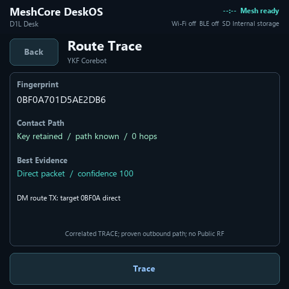

# SIGUI production-release handoff — 2026-07-18

This is the compact live handoff for the next implementation session. The machine-readable authority remains [COMPLETION_LEDGER.yaml](COMPLETION_LEDGER.yaml), the dependency graph remains [SIGUI_EXECUTION_BACKLOG_2026-07-12.yaml](completion/SIGUI_EXECUTION_BACKLOG_2026-07-12.yaml), and the ordered roadmap remains [ROADMAP.md](ROADMAP.md).

## Current answer

- **Last strict-verified weighted progress: 74%** (`74.2962962963%` raw at predecessor `d2489426`).
- **Current fail-closed live score: 64%** (`64.2962962963%` raw) while current-main artifact verification is pending.
- **Capability implementation: 80%** (`80.3703703704%` raw across 27 audited domains).
- **Final release gates: 0 of 11 green.** The firmware is not ready to tag or publish.
- Live merged `main` is `bd6ea0e685442d8a820766f4686395e50ca5397f` through PR #198; exact-main Actions `29651963484` passed.
- The last fully downloaded and checksum-verified strict evidence bank remains predecessor `d24894268d877c09644d41bb45f23a795af8b93d` / Actions `29645992569`. Its verification-receipt SHA-256 is `6142a4cc372186e269e6b9d9d9bca5372136303779db2bf308c6cf793569129d`.
- Do not transfer the predecessor artifact counts, checksums, physical evidence, or release-audit closure to current main. Current main has green CI, but its full artifact bank and physical qualification are still pending.
- The latest strict audit remains fail-closed: 6 pass / 30 fail, including 28 P0 and 2 P1 failures. The current GitHub issue set contains 21 P0 release-blocker issues and 8 other open issues; many are umbrella work packages rather than 29 distinct firmware defects.

## Merged since the strict evidence bank

| PR | Merged scope | Release meaning |
|---|---|---|
| #190 | Multi-width canonical TRACE paths | Software path handling advanced; compatible-peer RF remains open. |
| #191 | Real contact TRACE UI action and truthful correlation | Removes a dead UI path; physical UI and RF remain open. |
| #193 | Bounded post-flash feature matrix runner | Improves final hardware qualification; it is not physical proof itself. |
| #194 | Deterministic 1,000-transition UI lifecycle stress | Host lifecycle gate is green; exact-candidate touch/pixel/runtime proof remains open. |
| #195 | One GitHub Actions run per pull request | Removes duplicate CI work; no release gate is waived. |
| #196 | TRACE pending, 30-second no-response timeout, cooldown, and late-response correlation | User-visible TRACE lifecycle is implemented; controlled-peer multi-hop/RF acceptance remains open. |

## Open implementation stack

| PR | Head | State at handoff | Next action |
|---|---|---|---|
| #197 | `79d3efae9c784d65b70b0d79fae352b3ad5199aa` | Storage unchanged-write suppression; all checks passed, but the branch must be rebased on current main. | Rebase, rerun CI, then merge. |
| #198 | `f79d7a1a5fc6e18d0941b9f65309f4646b371050` | **Merged** as `bd6ea0e685442d8a820766f4686395e50ca5397f` after fully green PR Actions `29650798508`. | Exact-main Actions `29651963484` passed; policy correction does not claim physical RF closure. |
| #199 | `6c854159dfc37525ff4df2d57ca216e4b2303bc2` | Draft secure NimBLE companion foundation; host/conformance passed and firmware CI failed. | Fix the Actions compile failure, then finish Mesh-owner queue integration and hardware acceptance before merge/closure. |
| #192 | documentation branch | This handoff/roadmap checkpoint. | Validate, push, make ready, and merge after the implementation PR state above is recorded exactly. |

## Feature completion matrix

“Complete” below means the merged implementation surface is present. It does not waive exact-candidate hardware, interoperability, recovery, or release-gate evidence.

| Feature domain | Merged implementation | What still blocks production closure |
|---|---|---|
| Boot / board / display / touch | **Complete** | Frozen-candidate cold/warm boot, display, touch, power-cycle, and manual review. |
| Home / navigation | **Complete** | Frozen-candidate pixels, touch, focus, modal return, accessibility, and physical review. |
| Public messaging | **Complete** | Exact-candidate official-peer RF and retained/reboot acceptance. |
| Packets | **Complete** | Exact-candidate live traffic, long-history, SD scrollback, and physical UI acceptance. |
| Radio profile | **Complete** | Exact-candidate RF settings, failure/recovery, and peer interoperability. |
| SD bridge / core files | **Complete** | Full no-card/bad-card/card-size/electrical/power-loss/frozen-candidate matrix. |
| Diagnostics / crash / health | **Complete** | Final mixed-load and soak evidence with no crash/data-loss/security P1 defects. |
| Direct messages | **Advanced** | Official-peer ACK, retry, timeout, absent peer, reboot, duplicate, and fallback RF proof. |
| Contacts | **Advanced** | Official-client promote/import/export/key-change/recovery and physical workflow proof. |
| Heard nodes | **Advanced** | Max-record live-update stress, remaining capability/admin actions, and physical proof. |
| Channels | **Advanced** | Two independently keyed channels with official-client RF, reboot/reset/recovery, and UI proof. |
| Routes | **Advanced** | Controlled-peer direct/stale/missing/failed path and flood-fallback RF evidence. |
| TRACE | **Advanced** | Compatible-peer multi-hop request/response, cooldown/no-response behavior, and exact physical proof. |
| Identity / adverts | **Advanced** | Full retained lifecycle, recovery, official-peer interoperability, and physical proof. |
| Retained history | **Advanced** | Merge #197, then power-loss, card-lineage, write-amplification/endurance, and recovery proof. |
| Map | **Advanced** | Live provider/cache/fetch/cancel/revisit, SD persistence, markers, memory, and physical pan/zoom proof. |
| Wi-Fi | **Advanced** | Combined-candidate connect/reconnect/reboot/wrong-password/weak-signal/low-memory/coexistence proof. |
| Emoji / UTF-8 | **Advanced** | Physical keyboard/input, overflow, rendering, and accessibility proof. |
| QR sharing | **Advanced** | Official-client scan/import round trip and physical screen proof. |
| Packaging / release | **Advanced** | Frozen full ESP32+RP2040 build, reproducibility, checksums, authenticated provenance/SBOM, audit, tag, and publish. |
| Repeater / room administration | **Partial** | Finish the single Mesh owner, compatible authentication/session, allowlisted mutations, redaction, UI, and RF proof. |
| Notifications | **Partial** | Finish notification behavior, unread truth, accessibility, and physical acceptance. |
| Terminal / log view | **Partial** | Finish user-facing terminal/log workflows, bounds, redaction, and physical acceptance. |
| Local GPS / own location | **Partial / intentionally no onboard GPS** | Preserve truthful no-GPS behavior; finish manual-location and companion-location product decision/acceptance. |
| Observer / MQTT | **Partial** | Product/privacy decision, implementation if retained, truthful UI, and acceptance. |
| BLE companion transport | **Not merged** | Draft #199 compile fix, queue ownership, bonding/PIN management, official-client hardware, coexistence, 100 cycles, and soak. |
| Signed SD / OTA update and recovery | **Not started** | Partition/migration decision, signing and anti-rollback, interruption-safe install/recovery, upgrade matrix, docs, and hardware proof. |

## Current UI screenshots

These 480×480 images were regenerated on 2026-07-18 from the current merged UI base `9edc22f` with `tools/ui_simulator.py`. They are current design/regression references, **not device photos and not physical release evidence**.

| Home | Messages | Nodes |
|---|---|---|
|  |  |  |
| Map | TRACE | Tools / Settings |
|  |  |  |

## Remaining path to production

1. Rebase and merge #197 after green CI; bank current-main #198 only after exact-main Actions finish; keep #199 draft until the firmware build and secure companion integration are real.
2. Close remaining WP-05/WP-06/WP-11 protocol, ownership, durability, and power-loss software boundaries.
3. Finish the still-incomplete product features: administration, diagnostics/Terminal, Map lifecycle, BLE, notifications/accessibility, observer decision, and signed update/recovery.
4. Freeze one exact candidate and dispatch the full GitHub Actions build with `include_sd_bridge=true`; download every artifact, verify checksums, inventory, provenance, and SBOM before flashing.
5. Flash only the checksum-verified exact candidate to the D1L on the authorized port. Never use COM8, COM11, or COM29; never format an SD card on-device.
6. Run one batched exact-commit physical qualification: boot/display/touch, all UI workflows, official-peer RF/DM/channel/PATH/TRACE, Wi-Fi, BLE, SD/card/electrical/power-loss, Map, signed update/upgrade/recovery, and fault paths.
7. Run the final soak only after all feature tests pass, then require `ready_for_public_release=true`, zero known P0 defects, zero crash/data-loss/security P1 defects, reproducible artifacts, and complete install/upgrade/recovery docs before tagging and publishing.
